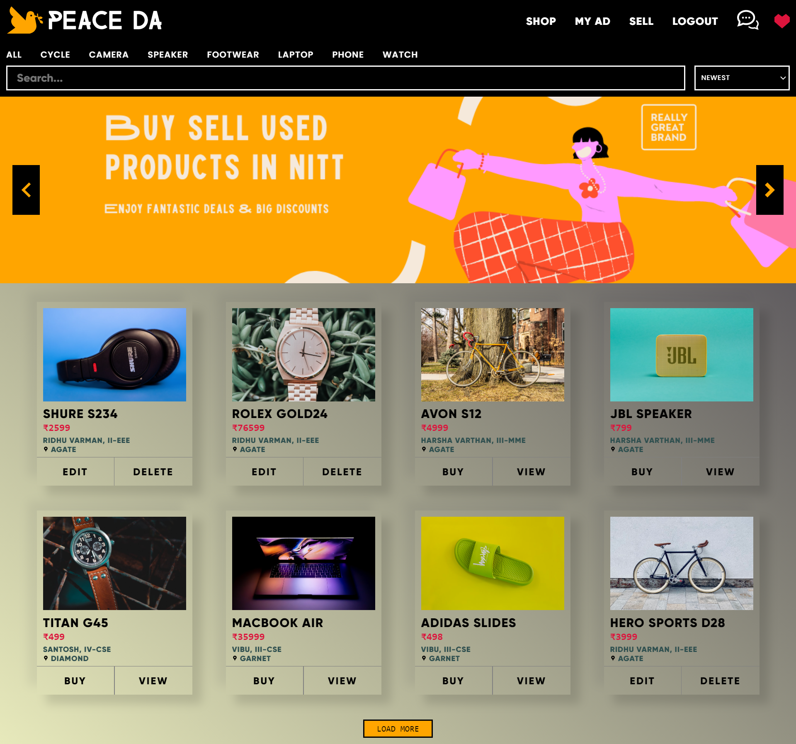
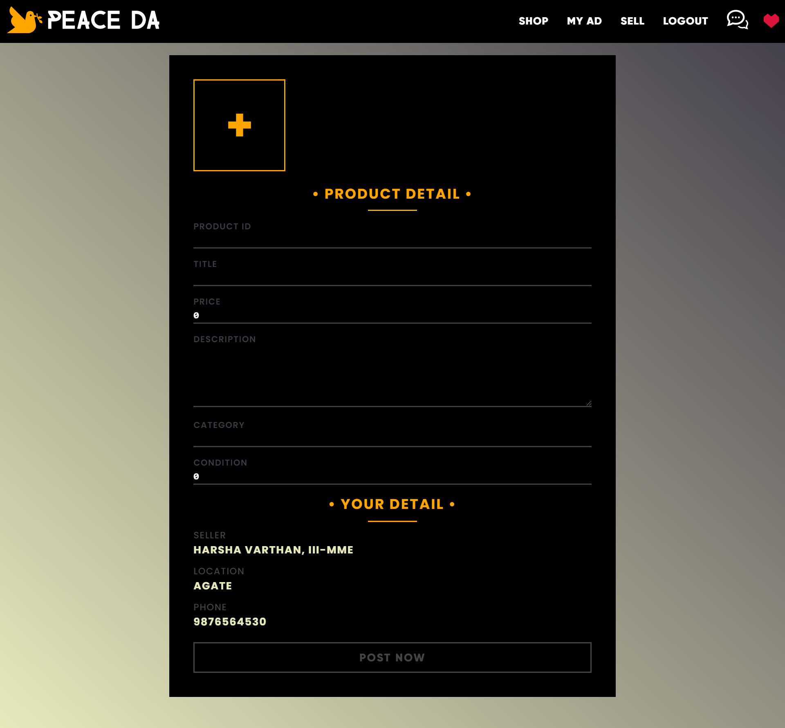

# react-classified-ads
peace da is a mern stack classified ads web application for college students to sell and buy used products within college campus.
## built with

  

     &nbsp;&nbsp;
     &nbsp;&nbsp;
     &nbsp;&nbsp;
     &nbsp;&nbsp;
     
     
     
  

  plus, 28+ cups of coffee, 168+ hours of code, 76+ hours of spotify etc.

## screenshots
homepage-

product preview page-

post ads-

chat with seller-

## features(version 1)

--/ user login/register

--/ user can search, sort, filter products

--/ user can post, edit and delete their ads

--/ in-buit chat system to chat with the seller

--/ and many more

## work under progress
> this app is under construction and being updated regularly. currently working on features like -

--/ wishlist

--/ read recipients for chat

--/ improving UI/UX

